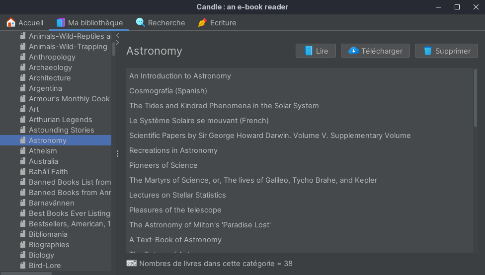
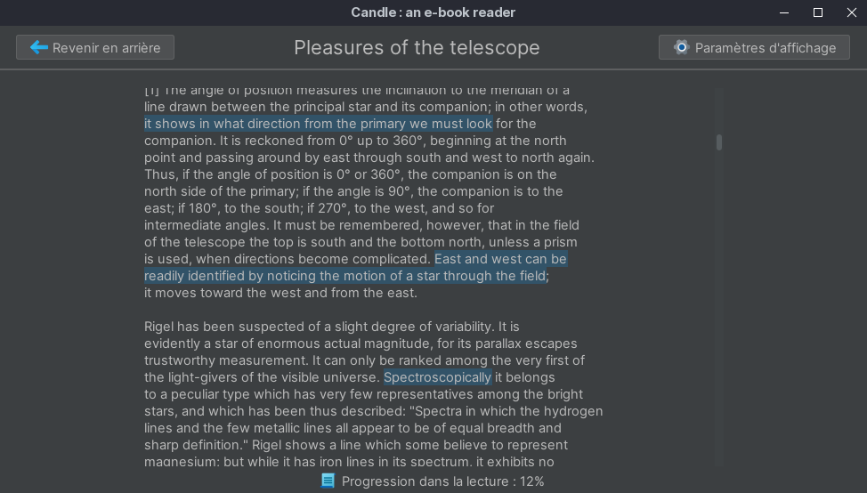

# Candle - an e-book reader

## Introduction

University project that was made for the "object oriented programming" class. It's a crossplatform desktop application made with the gui library Java Swing. The main goal was to browse categories and read books from the ["Project Gutenberg"](https://www.gutenberg.org/) free online library. There's a few extra features like a search bar, the option to download books, annotate, get the definition of a word, change theme, take notes etc.

